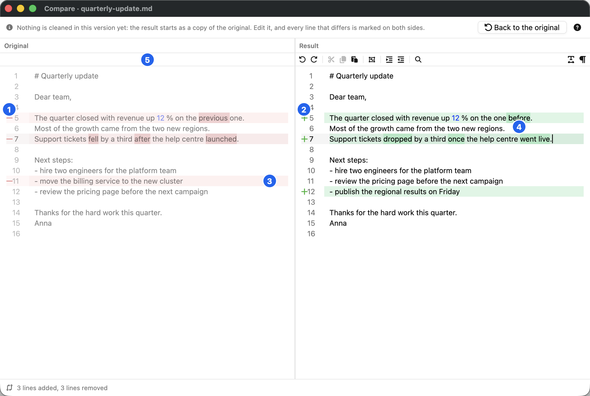
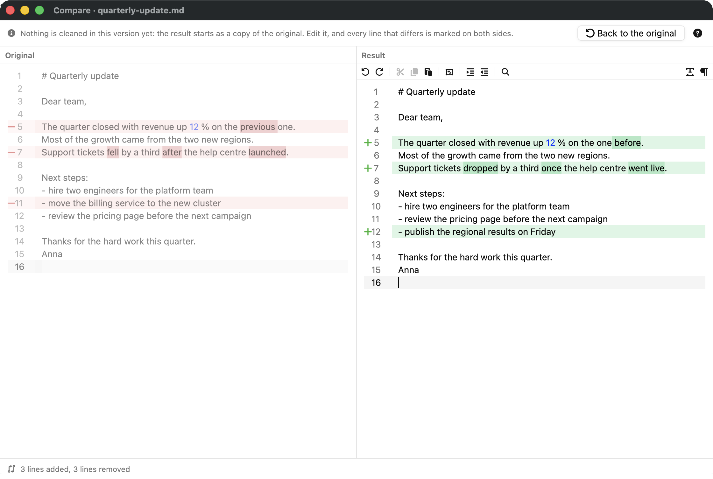
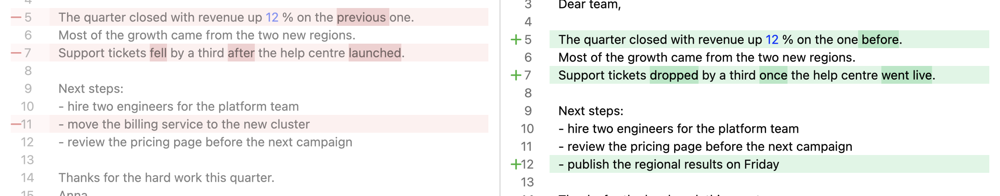
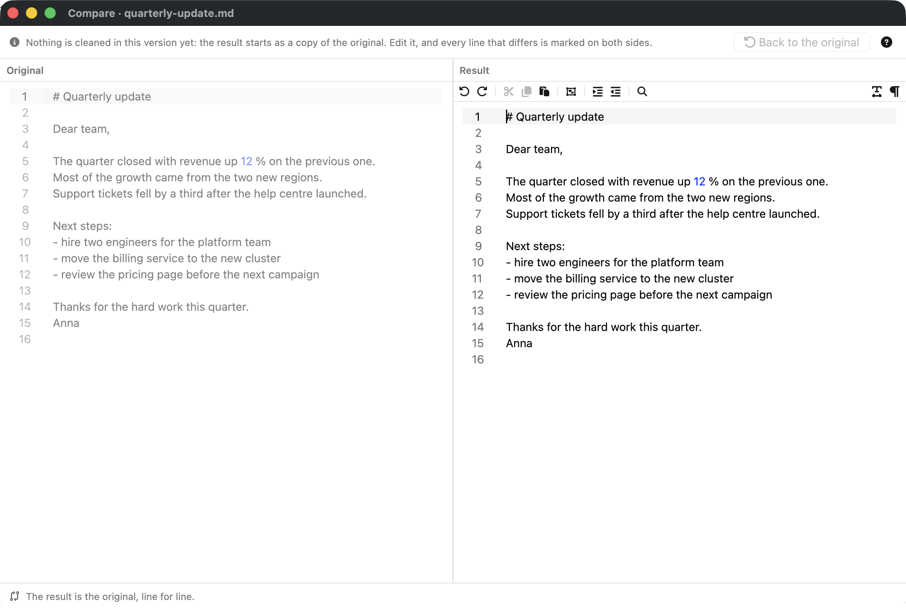

# Line decorations — the `LineDecorationProvider` patch

What the patch is, what it is for (with screenshots of the result we
want to keep), where it lives now, what upstream has instead, and what
any replacement has to do. This is the one thing in our gpui-component
fork that upstream does not have; it is the reason the fork exists.

Assembled 2026-10-03 on `feat/e0-e6-shell`. The patches are under
[`line-decorations/patches/`](line-decorations/patches/), the
screenshots under [`line-decorations/`](line-decorations/).

---

## 1. What we want — the Compare window



*The Compare window on `quarterly-update.md` after the result was
edited: lines 5 and 7 reworded, line 11 removed, a new line 12 added.
Light theme, macOS, 1120 × 753 pt, captured at 2× with lazy-shot
(screenshot `wipemark-compare-line-decorations`, id 1065; the markers
are also kept as lazy-shot's own overlay,
`wipemark-compare-line-decorations-annotated`, id 1066) from a debug
build of `feat/e0-e6-shell` at `1d041be`.*

| # | mark | what it says | painted by |
|---|---|---|---|
| 1 | **gutter glyph `−`** on the original, at the left edge of the line-number column | "this line is gone or changed", readable without colour | **`LineDecorationProvider`** (this patch) |
| 2 | **gutter glyph `+`** on the result | "this line is new or changed" | **`LineDecorationProvider`** (this patch) |
| 3 | **full-row tint**, edge to edge, red on the left and green on the right | which lines to read across — including a removed or added line, which has no words to mark | **`LineDecorationProvider`** (this patch) |
| 4 | **stronger tint behind a changed word** — `previous` / `before`, `fell` / `dropped`, … | what inside a changed line differs | `DocumentColorProvider` — upstream's LSP document-colour road, not this patch (`docs/architecture/compare.md`) |
| 5 | **blank strip** over the original, the height of the result's toolbar | line 1 on the left is level with line 1 on the right | our own layout (`result::TOOLBAR_HEIGHT`); its test reads both lines' tops through the patch's `visible_line_bounds` |

The same window without markers, and a close-up of the marked rows:





The tint sits *under* the text, the active-line outline stays on top of
it, indent guides stay visible over it. Without the patch the first two
rows disappear: only the word marks would remain, and a removed or added
line — which has no words to mark against anything — would show nothing
at all. For comparison, the same window before any edit, where nothing
is marked (captured an hour earlier, before the blank strip of marker 5
existed — note the original starting a toolbar higher):



The two sides line up (marker 5): line 1 of the original is level with
line 1 of the result because the original carries a blank strip the
height of the result's toolbar (`result::TOOLBAR_HEIGHT`; gate
`compare::tests::the_first_lines_sit_level`, which reads both lines'
on-screen tops through the patch's `visible_line_bounds`).

---

## 2. The API (fork commit `c319baca`, "P1")

`crates/ui/src/highlighter/line_decorations.rs`, new file, re-exported
from `gpui_component::highlighter`:

```rust
pub trait LineDecorationProvider: Send + Sync {
    /// Decorations for `visible_rows`; called once per frame.
    fn decorations_for(&self, visible_rows: Range<u32>, cx: &App) -> Vec<LineDecorationItem>;
}

#[derive(Clone)]
pub struct LineDecorationItem {
    pub line: u32,                          // buffer line, zero-based
    pub glyph: Option<LineDecorationGlyph>, // painted in the gutter
    pub line_tint: Option<Hsla>,            // full-line background, under the text
    pub tooltip: Option<SharedString>,      // reserved, not painted yet
}

#[derive(Clone)]
pub enum LineDecorationGlyph {
    DiffAdded, DiffRemoved, DiffChanged, Conflict, Bookmark, Breakpoint,
    Custom { icon: IconName, color: Hsla },
}
```

On the editor (`crates/ui/src/input/state.rs`, `mode.rs`):

```rust
impl InputState {
    pub fn set_line_decoration_provider(&mut self, provider: Option<Arc<dyn LineDecorationProvider>>, cx: &mut Context<Self>);
    pub fn line_decoration_provider(&self) -> Option<Arc<dyn LineDecorationProvider>>;
}
// InputMode::CodeEditor gains `line_decoration_provider: Option<Arc<dyn LineDecorationProvider>>`, default None.
```

**How it paints** (`crates/ui/src/input/element.rs`): a new
`layout_decoration_glyphs()` runs in prepaint, asks the provider for the
current visible-row range, and prepaints one `Icon` element per item
that carries a glyph, at the left edge of the gutter, 12 px wide (on a
line-number column wider than about three digits the glyph overlaps the
leftmost digit — the JetBrains convention). The paint pass adds a
line-tint loop **between the active-line tint and the indent guides**,
then paints the glyphs after the fold icons. `None` changes nothing.
One test: `input::state::tests::set_line_decoration_provider_round_trips`.

Two companion commits ride on top:

| commit | what | status upstream |
|---|---|---|
| `bd0118ac` P2 | theme key `editor.gutter.background` | merged as #2411 |
| `a2f9c95b` P3 + P4 | arrow cursor over the line-number gutter; `InputState::line_number_hitbox()` and `visible_line_bounds(row)` | draft PR #2412, open, no review |

The fork's other four commits (`selected_range`, viewport accessors,
scroll past the last line, public `ThemeStyle` fields) are not about
decorations; the first three are merged upstream (#2278, #2279, #2410 —
the last one renamed to `scroll_beyond_last_line`), the fourth (#2322)
was closed for inactivity.

---

## 3. Who uses it

**wipemark-app** — the Compare window:

| what | where |
|---|---|
| import | `apps/wipemark-app/src/compare.rs:95-97`, `apps/wipemark-app/src/result.rs:55` |
| `impl LineDecorationProvider for Marks` — `DiffRemoved` + red tint on the original, `DiffAdded` + green tint on the result, cut to the visible rows | `compare.rs:426-441` |
| attaching one provider per side | `compare.rs:788-796`; `result.rs:297-305` (`ResultEditor::decorate`) |
| gates | `compare::tests::marks_are_cut_to_the_visible_rows`, `compare::tests::lines_alone_put_no_provider_on_either_side`, `compare::tests::the_first_lines_sit_level` (uses P4's `visible_line_bounds`) |
| also from the fork | `selected_range()` for Cut/Copy (`result.rs:343`) — upstream since #2278 |
| documented | `docs/architecture/compare.md`; `docs/architecture/icons.md` (`plus.svg`/`minus.svg` are these glyphs) |

**heretic-amuse-merge** — the merge editor's conflict and diff gutter:
`crates/heretic-editor/src/decoration.rs` (its own `LineDecoration`
trait bridged onto the upstream-shaped one, lines 23-24 import it),
`crates/heretic-editor/tests/decoration_view_integration.rs`. It also
uses the viewport accessors, scroll-past-last-line, `ThemeStyle` fields
and P2. Both repositories pin the same submodule commit and are bumped
together.

---

## 4. Where it lives (since 2026-10-03)

| | |
|---|---|
| repository | **`GigLaboCom/gpui-component`** — a fork of `longbridge/gpui-kit` (upstream renamed from `gpui-component`) |
| pinned branch | `heretic/epic-4-line-decorations` @ `a2f9c95b` — **protected**: no force-push, no deletion, admins included |
| base | upstream `b67d4ef8` (#2267, 2026-04-21), the last commit before `aba68aad` replaced `gpui::Corner` with `Anchor` (zed#47154) — which is what lets the fork build against our zed `gpui@81b16f46` |
| also copied | the other five `heretic/*` branches from the personal fork `glani/gpui-component` (which stays until heretic-amuse-merge is switched too) |
| this repository | `.gitmodules` points at the org fork with `branch = heretic/epic-4-line-decorations`; CI runs `git submodule sync --recursive` before `update` |
| patches here | `line-decorations/patches/0001-…` (P1), `0002-…` (P2), `0003-…` (P3 + P4), `git format-patch` of the three commits |
| on current upstream | **ported**: branch `heretic/line-decorations-on-upstream` (`3fba497`) on the org fork — upstream `main` `2c5162f8` underneath, five commits on top (`row_bounds`, line decorations, the gutter cursor, a marker-placement fix, comments matched to the surrounding style) — and **draft upstream PR [longbridge/gpui-kit#3359](https://github.com/longbridge/gpui-kit/pull/3359)**. API, old → new mapping, how `compare::Marks` migrates, test results and the PR text: [`line-decorations/upstream-port.md`](line-decorations/upstream-port.md) |

---

## 5. What upstream has instead

- **No gutter-glyph or full-line-tint API.** P1 was never proposed
  upstream (a search for "LineDecoration" finds nothing).
- **#3040** (merged 2026-09-23) added `TextDecorationCollection` and
  `RangeDecorationCollection` (`Fill`, `Frame`) — Monaco-like, tracked
  across edits, over byte ranges. Its description says *"Gutter markers
  and inline widgets are outside this PR"*. A `Fill` over a whole line
  tints the text's width, not the row edge to edge.
- **#2619** (third-party breakpoint gutter) received CHANGES_REQUESTED
  from the maintainer: *"I don't think this is a good API design"*.
- Upstream also moved on underneath: crates split into
  `crates/component` + `crates/base` + `crates/kit`, edition 2024,
  `gpui` from crates.io as `gpui-pre =0.3.7` (a zed snapshot), the
  editor became `EditorState`/`Editor` (#2691, #2716), `InputState.lsp`
  is `pub(crate)` behind `lsp()`/`lsp_mut()`. Version 0.7.0 is on
  crates.io (2026-09-28).

---

## 6. What any replacement must do

Whether the patch is ported, re-proposed upstream in another shape, or
replaced by something we draw ourselves beside the editor, the Compare
window needs all of this, and its tests say so:

1. **A glyph per line in the gutter**, beside the line number, readable
   without colour (`+`, `−`), themed from the theme's success/danger.
2. **A full-row tint**, edge to edge, *under* the text, under the
   active-line outline and under indent guides — not the width of the
   text.
3. **Asked per frame for the visible rows only**, cheap: a 10 000-line
   diff must not cost a frame (`marks_are_cut_to_the_visible_rows`).
4. **Nothing attached = nothing changes** (`lines_alone_put_no_provider_on_either_side`
   relies on the same shape for the word marks).
5. **Independent of the word marks**, which stay on the document-colour
   road (`docs/architecture/compare.md` explains why that road and its
   empty edit).
6. **The on-screen bounds of a row** are readable, so alignment can be
   tested (`the_first_lines_sit_level`).

The port to current upstream (§4, last row) is the first step toward
both dropping the fork and getting the API upstream: it is built in
#3040's shape — `EditorState::create_line_decorations_collection`, a
`LineDecorationProvider` asked per frame, `LineDecoration::new(row)
.with_background(..).with_marker(GutterMarker::DiffAdded)`, a
`gutter_marker_renderer` beside `fold_icon_renderer`, and `row_bounds`
for the on-screen band of a row — and is up for review as #3359. Moving *wipemark* onto that
branch is a separate piece of work: it also moves `gpui` by about eight
months (`Corner` → `Anchor` and whatever else changed underneath the
AppKit code in `pasteboard.rs`, `screen.rs`, `panel.rs`,
`dock_icon.rs`), and heretic-amuse-merge has to move with it.

---

## Sources

- Fork commits `c319baca`, `bd0118ac`, `a2f9c95b` (messages quoted
  above; patches in `line-decorations/patches/`).
- heretic-amuse-merge `docs/upstream.md` (the "temporary fork → PR →
  delete the fork" plan, 2026-05-29) and commits `53cfa3f`, `2c8c5ba`.
- Upstream: <https://github.com/longbridge/gpui-kit> — PRs #2278,
  #2279, #2322, #2410, #2411, #2412, #2619, #3040, #2691, #2716; tag
  `v0.7.0`.
- The investigation of 2026-10-03, recorded in `docs/plan/README.md`
  §8 risk R1 and in Watchword (`wipemark-status-2026-10-03` and this
  document's copy).
